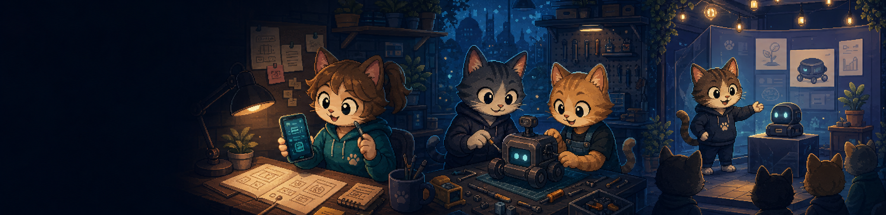

# 喵喵世界创业卡牌游戏 Demo

一个以真实创业流程为核心、以“喵喵世界”为视觉背景的卡牌策略网页游戏。

玩家需要组建创业团队、选择初始牌库，并通过产品立项、技术研发、资金管理、供应链、市场推广和正式发售等阶段，完成一段完整的创业旅程。

## 最新版本

### v1.0.0：增加喵喵世界背景与优化 UI

本次版本加入完整的喵喵世界视觉背景，并系统优化首页、人格选择、牌库、路线、关卡、对战、奖励、事件、商店、结算和最终后记页面。

主要更新：

- 更新喵喵世界首页、团队、路线、章节和事件插画。
- 统一主要页面的工业像素视觉风格。
- 重做章节奖励页与三选一奖励卡布局。
- 更新自由创业与 Mphone 路线的章节奖励卡图片。
- 优化外部事件、商店、出战配置和历史事件弹窗。
- 完善阶段成功、阶段失败和全关卡结局页面。
- 修复商店操作无效、页面滚动重叠等问题。
- 清理偏离创业主题的临时文案，保留正常创业流程描述。
- 整合为统一的 `index.html` 正式入口。

[查看 v1.0.0 完整更新说明](https://github.com/hex-meow/startup-card-game-demo/releases/tag/v1.0.0)

## 游戏内容

当前 Demo 包含两类创业体验：

- 自由创业路线：银发经济、喵工智能、绿喵能源。
- 创业案例路线：Mphone 的诞生。

完整流程包括：

- 喵群人格选择
- 初始牌库配置
- 创业路线与关卡选择
- 卡牌对战
- 章节奖励
- 外部事件
- 关卡商店
- 出战配置
- 阶段成功与失败结算
- 全关卡结局与后故事汇

## 启动方式

### 方式一：直接打开网页

进入 `游戏demo` 目录，双击 `index.html` 即可打开游戏页面。

这种方式适合快速查看界面和体验基础玩法，但受浏览器本地文件安全策略影响，可能出现以下问题：

- 故事进度无法保存或恢复。
- 故事续写功能无法连接本地服务。
- 部分图片、脚本或按钮可能受到浏览器限制。
- 不同浏览器的本地文件显示效果可能不同。

如果出现空白页、图片缺失、按钮无响应或进度无法保存，请使用下面的推荐方式。

### 方式二：通过本地服务启动（推荐）

1. 进入 `游戏demo` 目录。
2. 双击 `启动本地故事Demo.cmd`。
3. 浏览器访问 `http://127.0.0.1:4173/index.html`。

本地服务方式支持完整资源加载、故事进度保存、阶段状态恢复和故事续写。

## 项目结构

正式 Demo 已统一为单一入口，由以下主要文件共同驱动：

- `游戏demo/index.html`：正式页面入口。
- `游戏demo/app.js`：游戏数据、流程与交互逻辑。
- `游戏demo/styles.css`：基础布局与通用组件。
- `游戏demo/industrial-theme.css`：正式工业像素主题。
- `游戏demo/assets/`：卡牌、人格、路线、章节和事件图片。
- `游戏demo/local_story_server.py`：本地服务与故事进度接口。

## 详细文档

- [项目文件、试玩方式与 Demo 明细](游戏demo/项目文件试玩与Demo明细.md)
- [本次更新说明](游戏demo/更新说明.md)
- [项目介绍与玩法说明](项目介绍与玩法说明/项目介绍与玩法说明.md)

## GitHub Release

- [v1.0.0：增加喵喵世界背景与优化 UI](https://github.com/hex-meow/startup-card-game-demo/releases/tag/v1.0.0)
