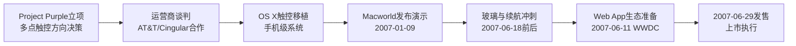

# 项目文件、试玩方式与 Demo 明细

## 1. 当前项目文件

- `index.html`：页面入口和全局弹窗容器。
- `styles.css`：线稿美术、卡牌、关卡、对战、编辑器样式。
- `app.js`：全部游戏数据、流程状态、卡牌效果、渲染和交互逻辑。

## 2. 试玩方式

这是一个静态网页原型。直接打开 `index.html` 即可运行。

如果浏览器因本地文件策略导致脚本或资源异常，也可以在 `D:\code` 目录下启动一个本地静态服务后访问页面。

## 3. Demo 明细与案例章节

### 3.1 模拟创业 Demo 明细

当前 demo 中，模拟创业路线包含 3 个行业赛道：

- 银发健康：照护、康复、慢病管理与家庭协同。
- AI效率工具：面向企业、创作者与专业岗位的流程提效。
- 绿色消费：可持续材料、低碳生活方式与新渠道消费。

玩家需要从画像池中选择：

- 核心人群 3 个
- 机会人群 3 个

画像会影响：

- 初始时间：进入第一关时的玩家血量。
- 时间上限：玩家时间可恢复到的最大值。
- 初始资金：用于打牌、买牌和路线成长。
- 难度系数：影响后续敌人的血量和攻击。

当前 demo 中，玩家从 20 张通用创业要素牌中选择 8 张，作为初始出战牌库。卡牌类型覆盖：

- 人员：工程师、产品经理、UI设计师、销售合伙人等。
- 技术：技术预研、架构重构、自动化工具等。
- 资金：天使资金、预售订单、众筹预热等。
- 管理/策略：团队对齐、砍掉非核心、导师背书等。

模拟创业路线的关卡间事件包括标准时间线事件和随机意外事件。当前 demo 中的事件可以围绕政策补贴、监管变化、供应短缺、媒体关注、团队波动、资金压力等方向展开。

### 3.2 案例：初代 iPhone 真实故事线

初代 iPhone 是一个真实公司故事线案例，定位是“真实产品从立项到发售”的独立关卡线。它不需要画像选择，也不需要手动选择初始牌，而是直接带入 Project Purple 主题牌库。

#### 3.2.1 iPhone 路线关卡

#### 3.2.2 iPhone 线专属卡牌

iPhone 线拥有专属基础卡牌，例如：

- 多点触控原型
- Purple保密室
- OS X瘦身
- Cingular谈判
- 可视语音信箱
- 光学玻璃表面
- 移动Safari
- 发布会走台
- 黄金演示路径
- Web App方案
- 门店首发排队
- 激活流程预案

这些卡牌用于表达初代 iPhone 开发中的技术、硬件、运营、发布会、运营商合作和发售执行。

#### 3.2.3 iPhone 线时间线事件

iPhone 线的关卡间事件使用 2007 年真实时间线节点：

- 2007-01-09：Apple Inc.登场
- 2007-01-10：Cisco商标诉讼
- 2007-05-17：FCC批准
- 2007-06-11：WWDC Web 2.0应用
- 2007-06-18：玻璃与8小时通话
- 2007-06-28：员工机与首发排队

每个事件都有正面和负面影响，并会转化成常驻效果。例如提高阶段奖励资金、增加敌人攻击、改变敌人血量、增加开局缓冲等。
