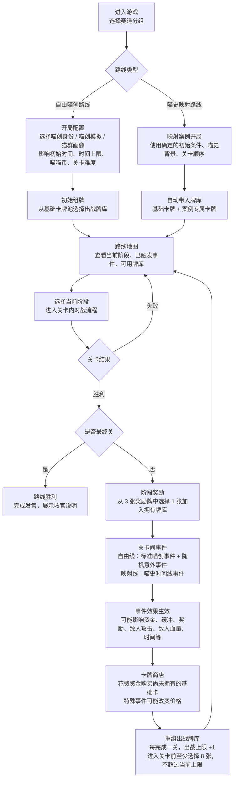
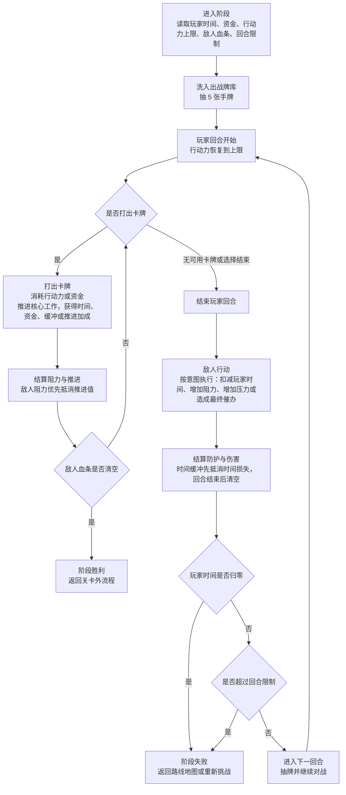

# 喵喵创业卡牌 项目介绍与玩法说明

## 1. 游戏背景

游戏以一个虚构的喵喵世界为舞台，把现实创业中的产品立项、团队协作、资金压力、技术风险、供应问题、监管变化、舆论波动和发售执行，转译成猫咪工坊、喵喵币、信号塔盟、爪印技术和喵史事件。玩法仍然是原来的卡牌对战与路线成长，改变的是内容表达方式：玩家看到的是喵喵世界里的创业故事，而不是现实公司、现实品牌和现实事件的直接复述。

游戏当前包含两个入口模式。“喵创模拟”的描述是“人生只有一次，而喵生有九次，快来试一试。”玩家在该模式中选择方向，再配置猫群画像和初始牌库，在有限时间与喵喵币下推进阶段目标。“喵星创业史”的描述是“每一段故事都只在喵星发生过，人类请勿对号入座。”该模式选取现实历史中的产品发展经历，转换为喵喵世界里的虚构案例。当前“初代喵掌机”归入喵星创业史。现实事件只作为内部映射依据，玩家侧以喵化名称、喵历节点和虚构势力呈现。

这次世界观迁移的核心原则是：不改变游戏规则、不改变数值含义、不改变关卡节奏，只替换内容层的命名、叙事、事件包装和后续内容生产流程。

## 2. 喵星世界观的意义

喵星世界观不是单纯的美术包装，而是整个项目的内容表达框架。它把真实创业世界中的公司、产品、人物关系、行业竞争和历史节点，转译成一个完全虚构的猫咪社会。这样做可以在保留现实逻辑和创业教育价值的同时，避免把玩家的注意力直接引向某个真实组织、真实人物或现实争议，降低误读、指认和有害联想的风险。

这个虚构背景也让现实情节更容易被游戏化处理。融资压力、技术债、供应链波动、平台规则、舆论反噬、组织内耗、商业谈判和监管节点，都可以被包装成喵喵世界里的势力、事件和关卡阻力。玩家不需要先理解复杂的现实背景，也能直观看到一个创业决策背后的代价、冲突和取舍。

另一方面，喵星世界观为表达现实创业中的灰度和暗面提供了更安全、更清晰的叙事空间。很多现实问题如果直接套用真实名称，容易显得尖锐、敏感或带有指向性；转译成喵星事件后，可以更直白地呈现问题本身，例如资源不均、规则变化、信息不对称、组织压力和市场情绪，而不是停留在具体对象的评价上。

最后，喵星世界观也方便未来扩展。除了映射现实历史案例，它还可以承载对未来行业、未来产品和未来组织形态的想象。新的赛道、新的技术趋势、新的商业模式和新的社会议题，都可以先在喵星世界中被虚构化、系统化，再转化为可玩的路线、卡牌、事件和结局。

## 3. 世界观转换规则

| 现实层内容 | 喵喵世界表达 | 转换要求 |
| --- | --- | --- |
| 创业公司 | 猫咪工坊、喵创团队、爪印实验室 | 保留创业决策压力，避免直接使用现实公司名作为玩家可见主称呼。 |
| 资金 | 喵喵币 | 数值仍叫资金也可以，但叙事中优先使用喵喵币。 |
| 用户画像 | 猫群画像 | 保留核心人群和机会人群的玩法差异。 |
| 行业赛道 | 喵创模拟 | 用喵喵世界的生活场景包装赛道。 |
| 真实公司故事线 | 喵史映射路线 | 现实来源保留在内部说明或创作备注，不直接作为主标题。 |
| 历史事件 | 喵史事件 / 喵历节点 | 可以保留日期结构，但事件名、势力名和物件名要喵化。 |
| 现实产品 | 虚构喵世界产品 | 例如“初代 iPhone”映射为“初代喵掌机”。 |

当前 Demo 的主要映射示例：

| 原现实原型 | 喵喵世界名称 | 用途 |
| --- | --- | --- |
| 初代 iPhone | 初代喵掌机 | 当前喵史映射路线。 |
| Project Purple | 紫铃计划 | 秘密立项阶段与专属牌库主题。 |
| Apple | 咬果工坊 | 现实公司原型的虚构映射。 |
| AT&T / Cingular | 长须信号塔盟 / 环铃信号塔盟 | 运营商谈判势力。 |
| OS X | X毛线系统 | 系统移植与技术卡牌主题。 |
| Safari Web App | 远巡浏览器织网应用 | 第三方生态入口。 |
| Cisco 商标诉讼 | 蓝桥商号名号争议 | 关卡间喵史事件。 |
| FCC 批准 | 高塔议会通行印 | 监管审批事件。 |

## 4. 关卡外流程

关卡外流程覆盖从路线选择、开局配置、选牌、进入关卡，到胜利后的奖励、事件、商店和重组卡牌。两类路线共用同一套成长结构，但开局配置、事件来源和卡牌内容不同。

| 环节 | 自由喵创路线 | 喵史映射路线 | 关键产出或数值 |
| --- | --- | --- | --- |
| 路线选择 | 玩家从零开始经营一个喵创项目。 | 玩家进入一个已设定的喵史映射案例。 | 确定后续开局方式、事件来源和卡牌池。 |
| 开局配置 | 选择喵创模拟和猫群画像。 | 使用案例锁定的初始条件，不需要选择画像。 | 初始时间、时间上限、初始资金、关卡难度。 |
| 初始选牌 | 从基础卡牌池中选择初始出战牌库。 | 自动带入案例主题牌库。 | 初始出战牌库、拥有牌库。 |
| 路线地图 | 展示当前项目阶段、可进入关卡、已触发事件和牌库状态。 | 展示喵史阶段、喵历节点、已触发事件和牌库状态。 | 当前阶段、常驻事件、可用卡牌。 |
| 阶段胜利 | 获得阶段奖励，进入事件、商店和重组流程。 | 使用同样成长流程，但奖励和卡牌围绕案例主题包装。 | 奖励牌、资金变化、事件常驻效果。 |
| 关卡间事件 | 标准喵创事件表达阶段节点，随机意外事件表达不确定因素。 | 喵史事件按照映射案例顺序发生。 | 正面效果、负面效果、常驻影响。 |
| 卡牌商店 | 花费资金购买尚未拥有的基础卡。 | 商店规则相同，可结合案例主题调整可见卡牌。 | 资金消耗、新增卡牌、可能的折扣。 |
| 重组卡牌 | 调整下一关出战牌库。 | 调整下一关出战牌库。 | 出战上限每关 +1；至少 8 张，不超过当前上限。 |
| 路线胜利 | 完成最终发售关卡。 | 完成喵史映射案例的最终发售或收官阶段。 | 展示最终发售成功和收官说明。 |

## 5. 关卡内对战流程

每个阶段关卡都是一场卡牌对战。关卡内流程专注于抽牌、打牌、推进核心工作、敌人行动和胜败判断。世界观迁移不改变这些规则。

| 对战数值 | 作用 | 变化方式 |
| --- | --- | --- |
| 玩家时间 | 玩家血量，归零则阶段失败。 | 敌人攻击会扣减；部分卡牌或事件可以恢复，但不能超过时间上限。 |
| 时间上限 | 玩家时间可恢复到的最大值。 | 由开局条件、事件或奖励影响。 |
| 资金 | 用于打出部分卡牌，也用于关卡外商店买牌。 | 通过卡牌、奖励、事件获得或消耗。 |
| 行动力 | 每回合打牌资源。 | 默认每回合恢复到上限，打牌时消耗。 |
| 敌人血条 | 当前阶段核心工作剩余量，清空则阶段胜利。 | 玩家卡牌推进核心工作后减少。 |
| 回合限制 | 阶段必须完成的时间边界。 | 超过限制仍未清空敌人血条则失败。 |
| 时间缓冲 | 临时防护，优先抵消敌人造成的时间损失。 | 通常由卡牌或事件获得，回合结束后清空。 |
| 推进加成 | 提升后续推进核心工作的效果。 | 由卡牌或事件提供。 |
| 阻力 | 敌人的防御值，优先抵消玩家推进。 | 敌人行动、事件或关卡设定可能增加。 |
| 压力 | 提高敌人后续攻击，造成更多时间损失。 | 敌人行动或事件可能增加。 |

## 6. 内容编辑器与转换工具

内容编辑器继续负责维护路线、关卡、事件、卡牌和数值参数。新增的内容转换工具负责把现实创业素材或旧版 Demo 文案转换成喵喵世界表达，重点处理命名、势力、产品、历史节点和叙事语气。

转换工具的边界：

- 只转换内容层，不改行动力、资金、血量、回合、牌效函数等玩法规则。
- 输出应保留现实来源备注，便于后续核对历史映射，但玩家可见字段使用喵化名称。
- 对专有名词使用统一映射表，避免同一个现实实体在不同卡牌或事件里出现多个喵化名字。
- 转换后需要人工审核，尤其是历史事件的敏感度、幽默尺度和教学清晰度。

具体字段和填写方式见独立文档：`内容编辑器必要参数表.md`。迁移计划见：`喵喵世界观迁移Roadmap.md`。

## 7. 补充文档

当前项目文件、试玩方式和 Demo 明细维护在 `游戏demo/项目文件试玩与Demo明细.md`。当前 Demo 已把文本内容迁移到喵喵世界观；美术资产和 PPT/DOCX 导出物的全面重制列入后续 roadmap。
