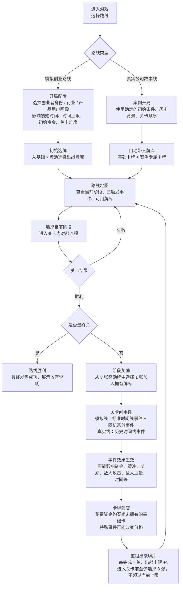
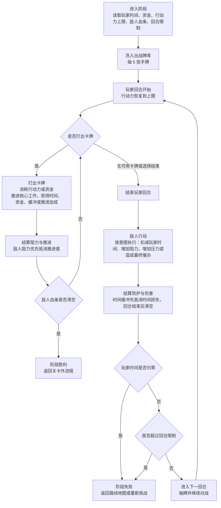

# 创业故事卡牌 项目介绍与玩法说明

## 1 游戏背景

游戏以创业项目从想法诞生到产品上市的完整过程为背景，将创业过程中经常出现的困难、不确定因素和关键决策转化为卡牌、关卡、事件和资源变化。玩家在推进项目的过程中，会持续面对时间不足、资金压力、团队能力限制、技术风险、市场反馈、供应问题、监管变化、舆论影响等挑战，并通过打出不同类型的卡牌来做出应对。

游戏当前包含两类路线。在模拟创业路线中，游戏希望帮助玩家理解模拟创业和早期项目推进的基本流程：如何选择目标人群，如何构建初始团队和能力组合，如何在有限资源下完成阶段目标，以及创业过程中可能遇到哪些常见问题。玩家不是单纯追求数值胜利，而是在一次次关卡和事件中体会创业决策的取舍。

在真实公司故事线中，游戏会选取现实企业的产品发展经历进行改编，让玩家以卡牌对战的方式体验企业在关键节点上的决策压力。真实公司故事线会围绕产品立项、关键合作、技术实现、发布准备、上市执行等阶段展开，使玩家在游玩中了解更多企业实战故事，以及真实产品从构想到面世背后的复杂过程。

## 2. 关卡外流程

关卡外流程覆盖从路线选择、开局配置、选牌、进入关卡，到胜利后的奖励、事件、商店和重组卡牌。两类路线共用同一套关卡外成长结构，但开局配置、事件来源和卡牌内容不同。

| 环节 | 模拟创业路线 | 真实公司故事线 | 关键产出或数值 |
| --- | --- | --- | --- |
| 路线选择 | 玩家从零开始模拟一个创业项目。 | 玩家进入一个已设定的真实企业案例。 | 确定后续开局方式、事件来源和卡牌池。 |
| 开局配置 | 选择创业者身份、行业方向和产品用户画像。 | 使用案例锁定的初始条件，不需要选择身份、行业或用户画像。 | 初始时间、时间上限、初始资金、关卡难度。 |
| 初始选牌 | 从模拟创业基础卡牌池中选择初始出战牌库。 | 自动带入案例牌库，包含基础卡牌和案例专属卡牌。 | 初始出战牌库、拥有牌库。 |
| 路线地图 | 展示当前项目阶段、可进入关卡、已触发事件和牌库状态。 | 展示真实案例阶段、历史节点、已触发事件和牌库状态。 | 当前阶段、常驻事件、可用卡牌。 |
| 阶段胜利 | 获得阶段奖励，进入事件、商店和重组流程。 | 使用同样成长流程，但奖励和可获得卡牌围绕案例主题包装。 | 奖励牌、资金变化、事件常驻效果。 |
| 关卡间事件 | 标准时间线事件表达创业阶段节点；随机意外事件表达不确定因素。 | 历史时间线事件按照案例真实顺序发生。 | 正面效果、负面效果、常驻影响。 |
| 卡牌商店 | 花费资金购买尚未拥有的基础卡。 | 商店规则相同，可结合案例主题调整可见卡牌。 | 资金消耗、新增卡牌、可能的折扣。 |
| 重组卡牌 | 调整下一关出战牌库。 | 调整下一关出战牌库。 | 出战上限每关 +1；至少 8 张，不超过当前上限。 |
| 路线胜利 | 完成最终发售关卡。 | 完成真实案例最终发售或收官阶段。 | 展示最终发售成功和收官说明。 |

## 3. 关卡内对战流程

每个阶段关卡都是一场卡牌对战。关卡内流程专注于抽牌、打牌、推进核心工作、敌人行动和胜败判断。

| 对战数值 | 作用 | 变化方式 |
| --- | --- | --- |
| 玩家时间 | 玩家血量，归零则阶段失败。 | 敌人攻击会扣减；部分卡牌或事件可以恢复，但不能超过时间上限。 |
| 时间上限 | 玩家时间可恢复到的最大值。 | 由开局条件、事件或奖励影响。 |
| 资金 | 用于打出部分卡牌，也用于关卡外商店买牌。 | 通过卡牌、奖励、事件获得或消耗。 |
| 行动力 | 每回合打牌资源。 | 默认每回合恢复到上限，打牌时消耗。 |
| 敌人血条 | 当前阶段核心工作剩余量，清空则阶段胜利。 | 玩家卡牌推进核心工作后减少。 |
| 回合限制 | 阶段必须完成的时间边界。 | 超过限制仍未清空敌人血条则失败。 |
| 时间缓冲 | 临时防护，优先抵消敌人造成的时间损失。 | 通常由卡牌或事件获得，回合结束后清空。 |
| 推进加成 | 提升后续推进核心工作的效果。 | 由卡牌或事件提供。 |
| 阻力 | 敌人的防御值，优先抵消玩家推进。 | 敌人行动、事件或关卡设定可能增加。 |
| 压力 | 提高敌人后续攻击，造成更多时间损失。 | 敌人行动或事件可能增加。 |

| 对战环节 | 玩家侧内容 | 敌人侧内容 | 胜败判断 |
| --- | --- | --- | --- |
| 回合开始 | 抽牌，行动力恢复，查看手牌和资源。 | 展示本回合敌人意图。 | 无。 |
| 玩家行动 | 打出卡牌，消耗行动力或资金，推进核心工作，获得资源或缓冲。 | 阻力会优先抵消推进效果。 | 敌人血条清空则阶段胜利。 |
| 结束玩家回合 | 玩家选择结束，或没有可用卡牌。 | 准备执行敌人意图。 | 无。 |
| 敌人行动 | 时间缓冲先抵消伤害。 | 可能扣减玩家时间、增加阻力、增加压力，或发动最终催办。 | 玩家时间归零则阶段失败。 |
| 回合结束 | 清空本回合时间缓冲，进入下一回合。 | 回合计数推进。 | 超过回合限制仍未完成则阶段失败。 |

## 4. 内容编辑器

内容编辑器用于把外部获取的真实企业故事、专业案例或行业资料，转换成游戏中的路线、关卡、事件、卡牌和战役结构。它可以帮助设计者快速把一个真实项目拆解为可玩的阶段流程，也能用于调整玩家初始资源、敌人强度、事件影响、卡牌效果和商店价格，从而控制游戏难度与节奏。

长期来看，内容编辑器也是第三方开源开发的基础：外部创作者可以在不改动核心代码的情况下，补充新的创业赛道、真实企业案例、历史事件和卡牌内容，让游戏逐步扩展为一个可共创的创业故事库。

具体字段和填写方式见独立文档：`内容编辑器必要参数表.md`。当前 Demo 的已填示例见：`内容编辑器实际Demo表格.xlsx`。

## 5. 补充文档

当前项目文件、试玩方式和 Demo 明细已拆分到 `项目文件试玩与Demo明细.md` 中单独维护。
